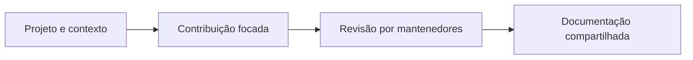

<div align="center">


# RunicTools

### Ferramentas pequenas. Trabalho bem documentado.

Repositório institucional do perfil público e das convenções compartilhadas de colaboração da organização RunicTools.

[](profile/README.md)

[Começar](#comece-aqui) · [Recursos](#o-que-você-encontra) · [Arquitetura](#como-o-projeto-se-organiza) · [Documentação](#documentação)

</div>

## Do objetivo ao resultado

| Conheça | Colabore | Cuide |
| --- | --- | --- |
| Perfil público e propósito da organização. | Contratos e templates compartilhados. | Reporte privado e responsabilidades documentadas. |



## O que você encontra

- Perfil público da organização em profile/README.md.
- Guias de contribuição, colaboração e reporte privado de vulnerabilidades.
- Templates de issues e pull requests para os projetos sem definições próprias.

## Comece aqui

Os comandos partem da raiz de um clone deste repositório, salvo quando incluem o próprio clone.

```sh
git clone https://github.com/runictools-com/.github.git
cd .github
```

Este repositório não é uma aplicação: não exige build, servidor ou banco. Leia os documentos abaixo e edite apenas o contrato correspondente ao objetivo da mudança.

## Como o projeto se organiza

| Caminho | Responsabilidade |
| --- | --- |
| [profile/README.md](profile/README.md) | Apresentação pública da organização. |
| [COLLABORATION.md](COLLABORATION.md) | Fluxo recomendado entre mantenedores. |
| [CONTRIBUTING.md](CONTRIBUTING.md) | Contrato de contribuição. |
| [SECURITY.md](SECURITY.md) | Orientação de reporte privado. |
| [CODE_OF_CONDUCT.md](CODE_OF_CONDUCT.md) | Conduta da comunidade. |
| [.github/ISSUE_TEMPLATE/](.github/ISSUE_TEMPLATE/) | Formulários de trabalho compartilhados. |

## Configuração e dados

Defaults da organização se aplicam aos repositórios que não fornecem seus próprios arquivos equivalentes. Código e instruções específicas de execução pertencem aos produtos. Consulte docs/ORGANIZATION_SETUP.md para contexto de administração; essa referência não substitui conferir a configuração atual do GitHub.

## Verificação

```sh
# Revisão documental: links, renderização Markdown e diff.
git diff --check
```

Os comandos acima são os pontos de verificação do projeto, não uma declaração de execução nesta revisão documental. Consulte os requisitos de cada ferramenta antes de rodá-los.

## Limitações e cuidados

Alterar uma política compartilhada afeta outros projetos. Esta atualização de apresentação não altera regras de segurança, permissões, contribuição ou automações. Nunca armazene credenciais, dumps, backups ou .env aqui.

## Documentação

- [Guia de manutenção e operação](docs/PROJECT_GUIDE.md)
- [English / detailed reference](README.en.md)
- [Perfil público](profile/README.md)
- [Colaboração](COLLABORATION.md)
- [Contribuição](CONTRIBUTING.md)
- [Segurança](SECURITY.md)

O banner é uma ilustração original de identidade criada com IA. Objetos, telas e valores ilustrados não são capturas da aplicação, resultados medidos nem marcas oficiais de terceiros.
